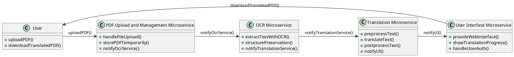

# AI SaaS Language Translation Service

This project is an AI SaaS Language Translation Service that enables users to upload PDFs in one language and get them translated into another language. The service uses OCR to handle various PDF layouts, ensuring high accuracy and preserving the original document structure.

## Table of Contents

- [AI SaaS Language Translation Service](#ai-saas-language-translation-service)
  - [Table of Contents](#table-of-contents)
  - [Background](#background)
  - [Features](#features)
  - [Architecture](#architecture)
    - [PlantUML Diagram for Architecture Overview](#plantuml-diagram-for-architecture-overview)
  - [Technologies Used](#technologies-used)
  - [Prerequisites](#prerequisites)
  - [Steps](#steps)
  - [Usage](#usage)
  - [License](#license)

## Background

The AI SaaS Language Translation Service addresses the challenges businesses face in managing multilingual documents across global operations. This service facilitates seamless communication by providing accurate translations of complex PDF documents, enabling better accessibility and understanding for international stakeholders.

## Features

- Support for major languages including English, Spanish, French, Portuguese, German, and Japanese.
- Utilize OCR to handle and preserve various PDF layouts including text in images, columns, and tables.
- Achieve a translation accuracy benchmark of at least 89%.
- Prioritize user privacy and data security by not storing sensitive information.
- Premium features such as high-precision OCR, expert review, batch uploads, custom translation memory, and enhanced security options.
- Integration with Stripe for payment processing and Clerk for secure authentication and user management.

## Architecture

The service adopts a microservices architecture to ensure scalability, flexibility, and easier maintenance. Key microservices include:

- **PDF Upload and Management Microservice**: Handles file uploads, storage, and preprocessing.
- **OCR Microservice**: Responsible for converting images and complex PDF layouts into editable text.
- **Translation Microservice**: Manages the translation of text using Opus-MT.
- **User Interface Microservice**: Provides the web interface for users to interact with the service.

### PlantUML Diagram for Architecture Overview


## Technologies Used

Tesseract OCR: For text extraction.
Opus-MT: For machine translation.
Docker and Kubernetes: For containerization and orchestration.
React + Next.js: For the frontend.
Node.js: For backend services.
Google Cloud Pub/Sub: For asynchronous messaging.
Google Cloud Firestore: For managing non-sensitive user data.
Google Cloud Storage: For temporarily storing PDFs.
Setup and Installation

## Prerequisites
Docker
Kubernetes
Node.js
Google Cloud Platform account

## Steps
Clone the repository

```bash
git clone https://github.com/your-repo/ai-pdf-translation.git
cd ai-pdf-translation
```

Set up environment variables
- Create a .env file in the root directory and configure necessary environment variables.
  
Build and run the microservices

```bash
docker-compose up --build
```

Access the service

The application will be accessible at http://localhost:3000.

## Usage

Upload PDF: Use the web interface to upload a PDF document.
Select Languages: Choose the source and target languages for translation.
Translate: Submit the document for translation.
Download: Once the translation is complete, download the translated document.

## License

This project is licensed under the MIT License.